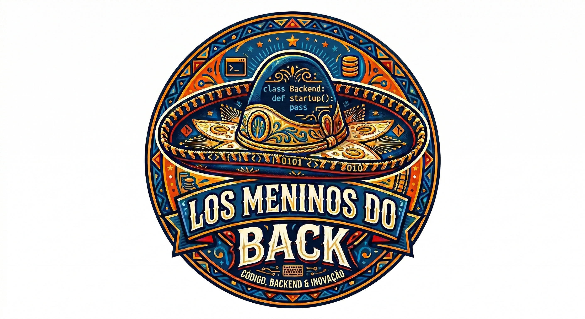

# FECAP - Fundação de Comércio Álvares Penteado

<p align="center">
<a href= "https://www.fecap.br/"></a>
</p>

# AlongApp

## Los meninos do back

## Integrantes: <a href="https://www.linkedin.com/in/breno-groba/">Breno Frederico Gonzalez Groba</a>, <a href="https://www.linkedin.com/in/artur-loreto/">Artur Loreto</a>, <a href="https://www.linkedin.com/in/gustavo-archangelo/">Gustavo Archangelo</a>, <a href="www.linkedin.com/in/luiizsilva/">Luiz Antonio Santos Silva</a>

## Professores Orientadores: <a href="https://www.linkedin.com/in/victorbarq/">Victor Bruno Alexander Rosetti de Quiroz</a>, <a href="https://www.linkedin.com/school/fecap/posts/?feedView=all">Kátia Milani Lara Bossi</a>, <a href="https://www.linkedin.com/school/fecap/posts/?feedView=all">Marco Aurelio Lima Barbosa</a>, <a href="https://github.com/roddai">Rodrigo da Rosa</a>


<p align="center">

  Developed by <a href="https://github.com/2026-2-NCC4/Projeto9">Los Meninos do Back</a> <a rel="license" href="https://creativecommons.org/licenses/by-sa/3.0/">CC BY-SA 3.0</a>
</p>

## Descrição

O AlongApp é um projeto desenvolvido pelo grupo Los Meninos do Back, formado por estudantes de Ciência da Computação da FECAP, como parte do Projeto Integrador (PI).
<br><br>
A proposta consiste na criação de uma solução digital para apoiar a rotina clínica da fisioterapeuta Maya Yoshiko Yamamoto, especialista em Reeducação Postural Global (RPG). O sistema foi idealizado para resolver problemas relacionados à falta de padronização no acompanhamento dos pacientes, à dispersão de informações clínicas e à dificuldade de monitoramento da evolução dos tratamentos.
<br><br>
A solução é composta por três principais módulos integrados:

## Componentes do Sistema

- **Aplicativo Mobile (Paciente):** Permite ao paciente acessar seus exercícios prescritos, visualizar conteúdos explicativos (como vídeos e imagens), registrar a execução das atividades e acompanhar sua evolução ao longo do tratamento.

- **Módulo Web (Profissional/Admin):** Painel administrativo utilizado pela fisioterapeuta para gerenciar pacientes, prontuários eletrônicos, exercícios e prescrições, além de acompanhar indicadores de desempenho e evolução clínica.

- **Backend (API) e Banco de Dados:** Responsável pelo processamento das regras de negócio, autenticação, controle de acesso, armazenamento seguro das informações e integração entre o aplicativo mobile e o sistema web.

O AlongApp tem como objetivo central modernizar a gestão clínica e otimizar o acompanhamento terapêutico, por meio da centralização de informações e da digitalização de processos, transformando o que antes era manual e descentralizado em uma plataforma digital integrada, segura e eficiente — trazendo benefícios tanto para a profissional quanto para seus pacientes e promovendo mais organização, praticidade e qualidade no atendimento fisioterapêutico, com impacto direto em melhores resultados clínicos.

## 🛠 Estrutura de pastas
```
📁 .idea
📁 documentos
├── 📁 Entrega-01
│   ├── 📁 Análise Inferencial de Dados
│   ├── 📁 Contabilidade e Finanças
│   ├── 📁 Engenharia de Software e Arquitetura de Sistemas
│   └── 📁 Projeto Interdisciplinar Ciencia de Dados
├── 📁 Entrega-02
│   ├── 📁 Análise Inferencial de Dados
│   ├── 📁 Contabilidade e Finanças
│   ├── 📁 Engenharia de Software e Arquitetura de Sistemas
│   └── 📁 Projeto Interdisciplinar Ciencia de Dados
├── 📄 MODELO_BANNER_FECAP_2026_1.pptx
├── 📄 Documento - Projeto de Extensão.docx
└── 📄 README.md
📁 imagens
📁 src
├── 📁 backend
├── 📁 mobile
└── 📁 web
🔥 .gitignore
📝 README.md
```
## 📁 Estrutura do Projeto ##
```
📄 Arquivos

- README.MD -> Este arquivo serve como guia geral do projeto, explicando sua estrutura, objetivos e instruções de uso.

📁 Pastas

- documentos/ — Contém todas as entregas solicitadas pelos professores!

- src/ — Código-fonte do projeto.
```
## 💻 Configuração para Desenvolvimento

### 🌐 Plataforma Web

**Ferramentas necessárias:**
- [VS Code](https://code.visualstudio.com/download)
- [Node.js](https://nodejs.org/)

**Passo a passo:**

**1. Clone o repositório e entre na pasta do projeto web:**
```bash
cd src/frontend
```

**2. Abra no VS Code:**
```bash
code .
```

**3. Abra o terminal integrado do VS Code** (`Ctrl+\`` no Windows/Linux ou `Cmd+\`` no macOS) **e instale as dependências:**
```bash
npm install
```

**4. Rode o projeto em desenvolvimento:**
```bash
npm run dev
```

> ✅ Compatível com **Windows**, **macOS** e **Linux**.

---

### 📱 Plataforma Mobile

**Ferramentas necessárias:**
- [Android Studio](https://developer.android.com/studio?hl=pt-br)
- [Node.js](https://nodejs.org/)

**Passo a passo:**

**1. Entre na pasta do projeto mobile:**
```bash
cd src/mobile
```

**2. Abra no VS Code:**
```bash
code .
```

**3. Instale as dependências:**
```bash
npm install
```

**4. Inicie o servidor Metro:**
```bash
npx react-native start
```

**5. Em outro terminal, rode no Android:**
```bash
npx react-native run-android
```

> ⚠️ Certifique-se de ter o **Android Studio** instalado e um emulador configurado (ou um dispositivo físico conectado via USB com depuração ativada).

> ✅ Compatível com **Windows**, **macOS** e **Linux**.
  
### 🌐 Backend Restfull

Para abrir este projeto você necessita das seguintes ferramentas:
- [VS Code](https://code.visualstudio.com/download)
- [Node.js](https://nodejs.org/)

#### Instalando as dependências
```bash
npm install
```
#### Rodando em desenvolvimento
```bash
npm run dev
```

### 🚀 Utilização


#### 📱 Mobile
Baixe o APK na pasta `src/executavel/` e instale no seu dispositivo Android.

> Para fazer login no aplicativo, utilize as seguintes credenciais:
E-mail: Paciente@test.com
Senha: paciente123

> ⚠️ Pode ser necessário habilitar a instalação de fontes desconhecidas nas configurações do seu dispositivo.

#### 🌐 Web
Acesse o projeto pelo link: [clique aqui para acessar](https://seu-link-aqui.vercel.app)

> Para fazer login no website, utilize as seguintes credenciais:
E-mail: contato@mayayamamoto.com.br
Senha: senha123


## 📋 Licença/License

<a href="https://github.com/2026-1-NCC3/Projeto4">Alongap</a> © 2026 by <a href="https://www.linkedin.com/in/breno-groba/">Breno Groba</a>, <a href="https://www.linkedin.com/in/artur-loreto/">Artur Loreto</a>, <a href="https://www.linkedin.com/in/gustavo-archangelo/">Gustavo Archangelo</a>, <a href="www.linkedin.com/in/luiizsilva/">Luiz Antonio Santos Silva</a>, <a href="https://www.fecap.br/">FECAP</a>
	is licensed under <a href="https://creativecommons.org/licenses/by/4.0/">CC BY 4.0</a> 

## 🎓 Referências

Aqui estão as referências usadas no projeto.

1. <https://mayayamamoto.com.br/>
